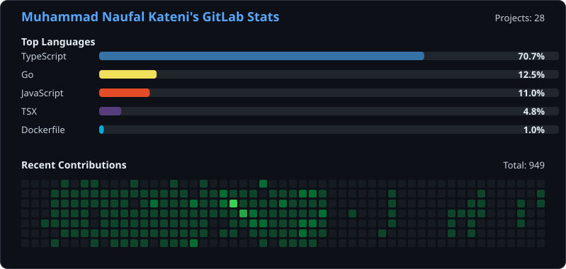

<h1 align="center">Hi, I'm Muhammad Naufal Kateni 👋</h1>

  

  
  
  

---

### 🙋 About Me

- 🛠️ Backend developer focused on **Express.js** and **TypeScript**
- 🔧 Experience building REST APIs, backend services, and database-driven applications
- 🐘 Also experienced with **Laravel**
- 🌱 Beginner open-source contributor — I enjoy learning, building, and contributing to projects in the developer ecosystem

### 🌐 Socials

  
  
  
  
  
  
  

### 💻 Tech Stack

**Programming Language and Framework**

**Database and ORM**

**Tool**

### 📊 GitHub Stats

  <picture>
    <source media="(prefers-color-scheme: dark)" srcset="https://github-readme-stats.vercel.app/api?username=NaufalK25&show_icons=true&hide_border=true&include_all_commits=true&theme=react&custom_title=NaufalK25's%20GitHub%20Stats" />
    <source media="(prefers-color-scheme: light)" srcset="https://github-readme-stats.vercel.app/api?username=NaufalK25&show_icons=true&hide_border=true&include_all_commits=true&theme=default&custom_title=NaufalK25's%20GitHub%20Stats" />
    
  </picture>
  <picture>
    <source media="(prefers-color-scheme: dark)" srcset="https://github-readme-stats.vercel.app/api/top-langs/?username=NaufalK25&theme=react&show_icons=true&layout=compact&hide_border=true&langs_count=8&custom_title=NaufalK25's%20Most%20Used%20Languages" />
    <source media="(prefers-color-scheme: light)" srcset="https://github-readme-stats.vercel.app/api/top-langs/?username=NaufalK25&theme=default&show_icons=true&layout=compact&hide_border=true&langs_count=8&custom_title=NaufalK25's%20Most%20Used%20Languages" />
    
  </picture>

  <picture>
    <source media="(prefers-color-scheme: dark)" srcset="https://github-readme-streak-stats.herokuapp.com?user=NaufalK25&theme=react&hide_border=true&date_format=j%20M%5B%20Y%5D" />
    <source media="(prefers-color-scheme: light)" srcset="https://github-readme-streak-stats.herokuapp.com?user=NaufalK25&theme=default&hide_border=true&date_format=j%20M%5B%20Y%5D" />
    
  </picture>

### 📈 Extended Metrics

<!-- Generated by .github/workflows/metrics.yml via https://github.com/lowlighter/metrics -->

  

### 🦊 GitLab

<!-- Generated by .github/workflows/gitlab-stats.yml -->

  

